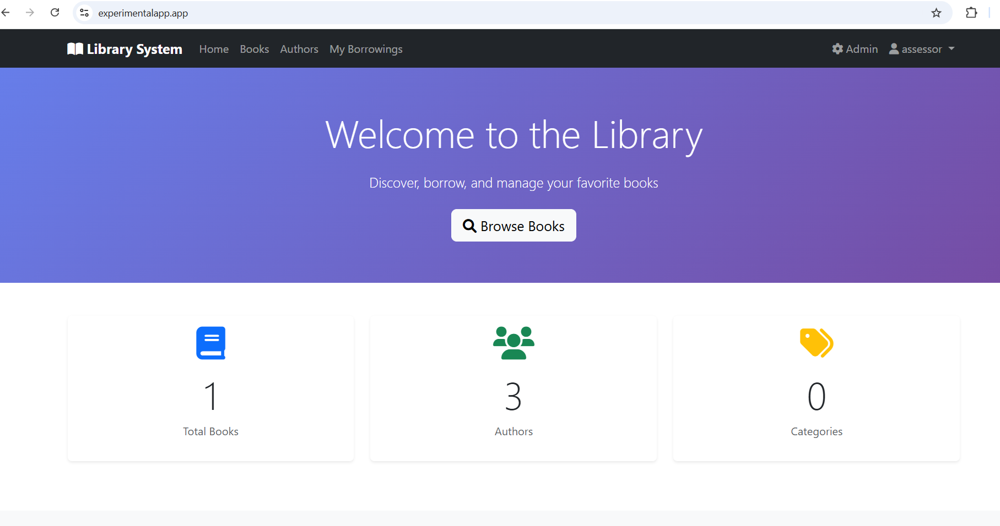
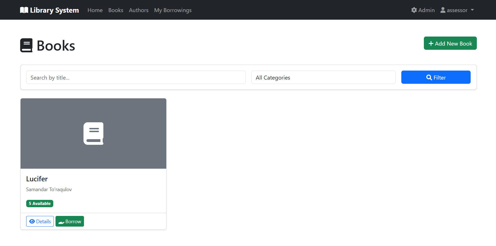
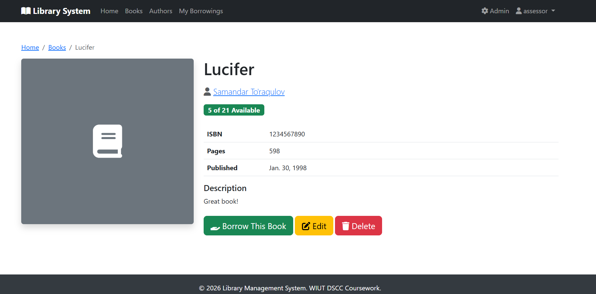
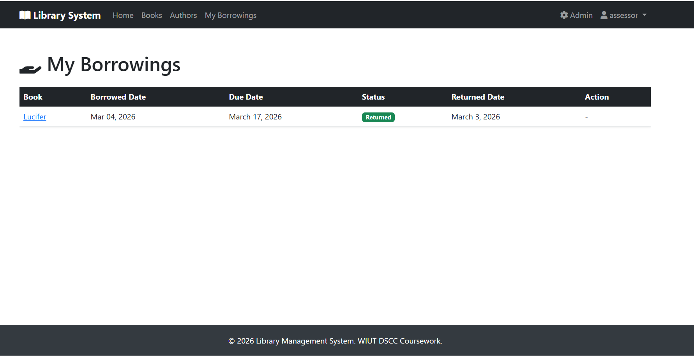

# Library Management System

A fully functional Django web application for managing library books, authors, and borrowings. Built with modern DevOps practices including Docker containerization, CI/CD pipeline, and cloud deployment.


## 🚀 Features

- **User Authentication**: Complete login, logout, and registration system
- **Book Management**: Full CRUD operations for books with cover images
- **Author Management**: View and browse authors with their book collections
- **Category System**: Organize books by categories/genres
- **Borrowing System**: Users can borrow and return books with due date tracking
- **Admin Panel**: Comprehensive Django admin for data management
- **Responsive Design**: Bootstrap 5 with mobile-friendly interface

## 🛠 Technologies Used

- **Backend**: Django 5.0+, Python 3.12
- **Database**: PostgreSQL 15
- **Web Server**: Nginx (reverse proxy), Gunicorn (WSGI)
- **Containerization**: Docker, Docker Compose
- **CI/CD**: GitHub Actions
- **Styling**: Bootstrap 5, Font Awesome

## 📊 Database Schema

```
┌─────────────┐     ┌─────────────┐     ┌─────────────┐
│   Author    │     │    Book     │     │  Category   │
├─────────────┤     ├─────────────┤     ├─────────────┤
│ id          │     │ id          │     │ id          │
│ first_name  │◄───►│ title       │────►│ name        │
│ last_name   │ M:N │ isbn        │ M:1 │ description │
│ bio         │     │ description │     └─────────────┘
│ birth_date  │     │ category_id │
└─────────────┘     │ authors     │
                    │ available   │
                    │ total       │
                    └──────┬──────┘
                           │ M:1
                    ┌──────▼──────┐
                    │  Borrowing  │
                    ├─────────────┤
                    │ id          │
                    │ user_id     │◄─── User (Django Auth)
                    │ book_id     │
                    │ due_date    │
                    │ status      │
                    └─────────────┘
```

## 🏃 Local Setup Instructions

### Prerequisites
- Python 3.12+
- Docker and Docker Compose
- Git

### Option 1: Docker (Recommended)

1. **Clone the repository**
   ```bash
   git clone https://github.com/wiut00015662/library-management-system.git
   cd library-management-system
   ```

2. **Create environment file**
   ```bash
   cp .env.example .env
   # Edit .env with your settings
   ```
# This is cool
3. **Run with Docker Compose**
   ```bash
   # Development
   docker compose -f docker-compose.dev.yml up --build
   
   # Production
   docker compose up --build -d
   ```

4. **Run migrations**
   ```bash
   docker compose exec web python manage.py migrate
   ```

5. **Create superuser**
   ```bash
   docker compose exec web python manage.py createsuperuser
   ```

6. **Access the application**
   - Development: http://localhost:8000
   - Production: http://localhost (via Nginx)
   - Admin: http://localhost/admin

### Option 2: Local Python Environment

1. **Clone and setup virtual environment**
   ```bash
   git clone https://github.com/wiut00015662/library-management-system.git
   cd library-management-system
   python -m venv venv
   source venv/bin/activate  # On Windows: venv\Scripts\activate
   ```

2. **Install dependencies**
   ```bash
   pip install -r requirements.txt
   ```

3. **Setup database**
   ```bash
   python manage.py migrate
   python manage.py createsuperuser
   ```

4. **Run development server**
   ```bash
   python manage.py runserver
   ```

## 🚢 Deployment Instructions

### Server Requirements
- Ubuntu 22.04 LTS (or similar)
- Docker and Docker Compose installed
- Domain name pointing to server IP
- Ports 80, 443, and 22 open

### Deployment Steps

1. **SSH into your server**
   ```bash
   ssh user@your-server-ip
   ```

2. **Install Docker**
   ```bash
   curl -fsSL https://get.docker.com | sh
   sudo usermod -aG docker $USER
   ```

3. **Clone repository**
   ```bash
   cd /opt
   git clone https://github.com/wiut00015662/library-management-system.git library-app
   cd library-app
   ```

4. **Configure environment**
   ```bash
   cp .env.example .env
   nano .env  # Edit with production values
   ```

5. **Setup SSL with Let's Encrypt**
   ```bash
   # Install certbot
   sudo apt install certbot
   
   # Get certificate
   sudo certbot certonly --standalone -d yourdomain.com
   ```

6. **Update Nginx configuration**
   - Edit `nginx/conf.d/default.conf`
   - Uncomment HTTPS server block
   - Update domain name

7. **Start the application**
   ```bash
   docker compose up -d
   docker compose exec web python manage.py migrate
   docker compose exec web python manage.py collectstatic --noinput
   docker compose exec web python manage.py createsuperuser
   ```

8. **Configure firewall**
   ```bash
   sudo ufw allow 22
   sudo ufw allow 80
   sudo ufw allow 443
   sudo ufw enable
   ```

## 🔐 Environment Variables

| Variable | Description | Default |
|----------|-------------|---------|
| `SECRET_KEY` | Django secret key | Required |
| `DEBUG` | Debug mode | False |
| `ALLOWED_HOSTS` | Allowed hostnames | localhost |
| `POSTGRES_DB` | Database name | library_db |
| `POSTGRES_USER` | Database user | postgres |
| `POSTGRES_PASSWORD` | Database password | Required |
| `POSTGRES_HOST` | Database host | db |
| `POSTGRES_PORT` | Database port | 5432 |

## 📸 Screenshots

### Home Page
*Library home page with statistics and recent books*

### Book List
*Browse and filter books by category*

### Book Detail
*View book details and borrow*

### My Borrowings
*Track borrowed books and return them*

## 🧪 Running Tests

```bash
# With Docker
docker compose exec web pytest

# Local
pytest
```

## 📁 Project Structure

```
library-management-system/
├── .github/
│   └── workflows/
│       └── deploy.yml        # CI/CD pipeline
├── library/                  # Main Django app
│   ├── migrations/
│   ├── admin.py
│   ├── forms.py
│   ├── models.py
│   ├── tests.py
│   ├── urls.py
│   └── views.py
├── library_project/          # Django project settings
├── nginx/                    # Nginx configuration
├── readme-images/            # README screenshots
├── templates/                # HTML templates
├── static/                   # Static files
├── Dockerfile               # Multi-stage Docker build
├── docker-compose.yml       # Production compose
├── docker-compose.dev.yml   # Development compose
├── requirements.txt
└── README.md
```

## 👤 Author

- **Student ID**: 00015662
- **Email**: wiut00015662@gmail.com
- **GitHub**: [@wiut00015662](https://github.com/wiut00015662)

## 📄 License

This project is part of WIUT DSCC Coursework 1.

---

*Built with ❤️ for Distributed Systems and Cloud Computing course*
